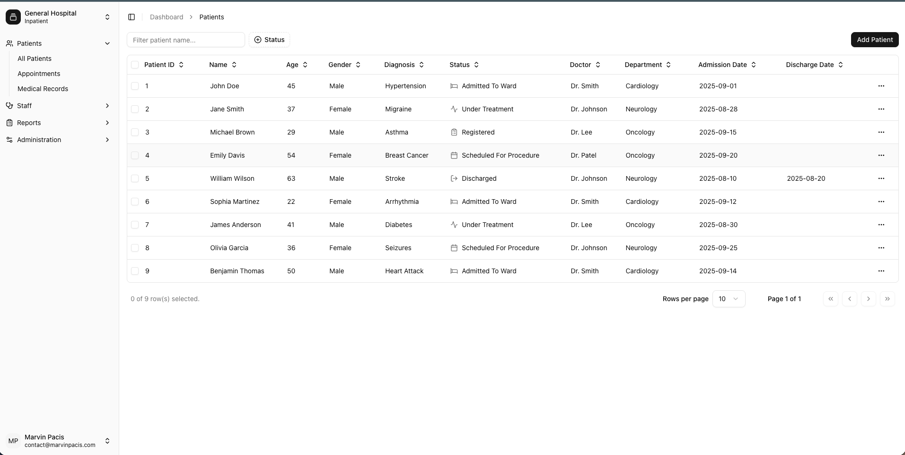
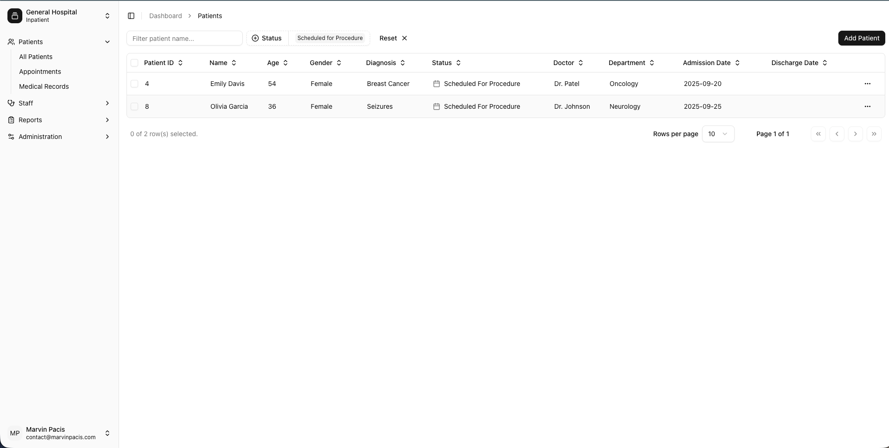
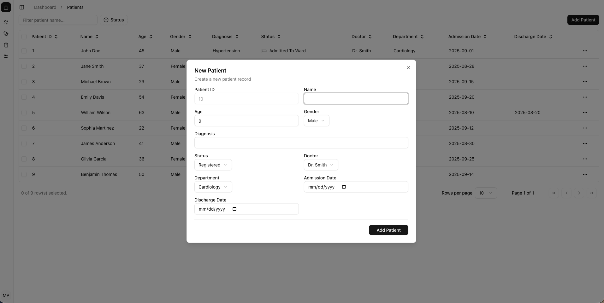

# Patient Management App

This repository contains the frontend code for a patient management application. It provides a user interface for adding and viewing patient records.

## Table of Contents

- [Project Overview](#project-overview)
  - [Features](#features)
  - [Screenshot](#screenshot)
  - [Links](#links)
- [Built With](#built-with)
- [Author](#author)

## Project Overview

This project is a frontend application designed to manage patient information and support telehealth consultations. It demonstrates best practices in React, TypeScript, Tailwind CSS, and Apollo Client.

### Features

- ✅ Dynamic filtering of patients (filtering, search and sorting functionality)

- ✅ Pagination

- ✅ Basic form for adding a new patient

### Screenshot

### Links

- [Live Link](https://patient-dashboard-livid.vercel.app)

## Built With

- [React](https://react.dev/) with [TypeScript](https://www.typescriptlang.org/) – A JavaScript library for building user interfaces with static type safety.
- [Next.js](https://nextjs.org/) – A React framework for building fast, modern web applications.
- [Apollo Client](https://www.apollographql.com/docs/react/) – A GraphQL client for data fetching.
- [Tailwind CSS](https://tailwindcss.com/) – A utility-first CSS framework for styling.

### State Management & Forms

- [Zustand](https://zustand-demo.pmnd.rs/) – A small, fast state management library.
- [React Hook Form](https://react-hook-form.com/) – Performant form validation with React hooks.
- [Zod](https://zod.dev/) – TypeScript-first schema validation.

### Developer Tools

- [ESLint](https://eslint.org/) – Linting tool for maintaining code quality.
- [Prettier](https://prettier.io/) – Opinionated code formatter.
- [Prettier Plugin Tailwind CSS](https://github.com/tailwindlabs/prettier-plugin-tailwindcss) – Auto-sorts Tailwind classes.

## Author

- GitHub - [marventures](https://github.com/marventures)
- LinkedIn - [Marvin Morales Pacis](https://www.linkedin.com/in/marventures/)
